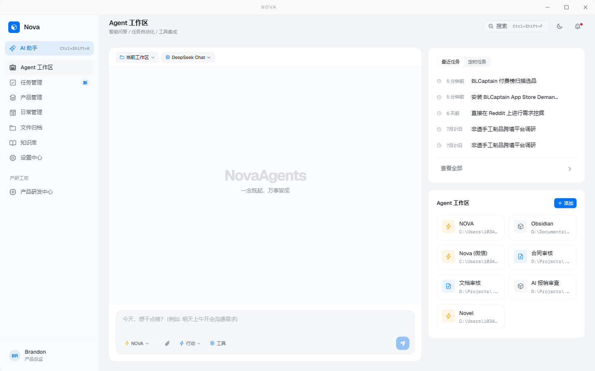
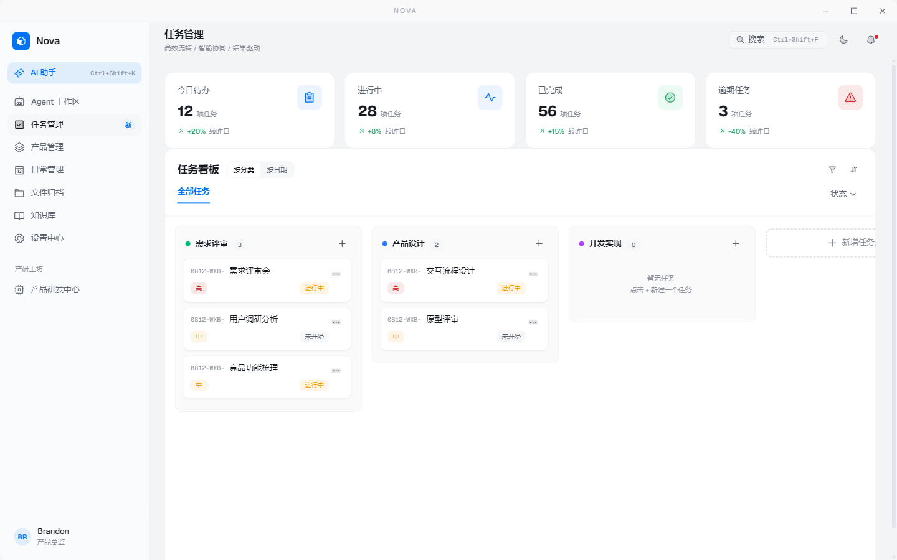
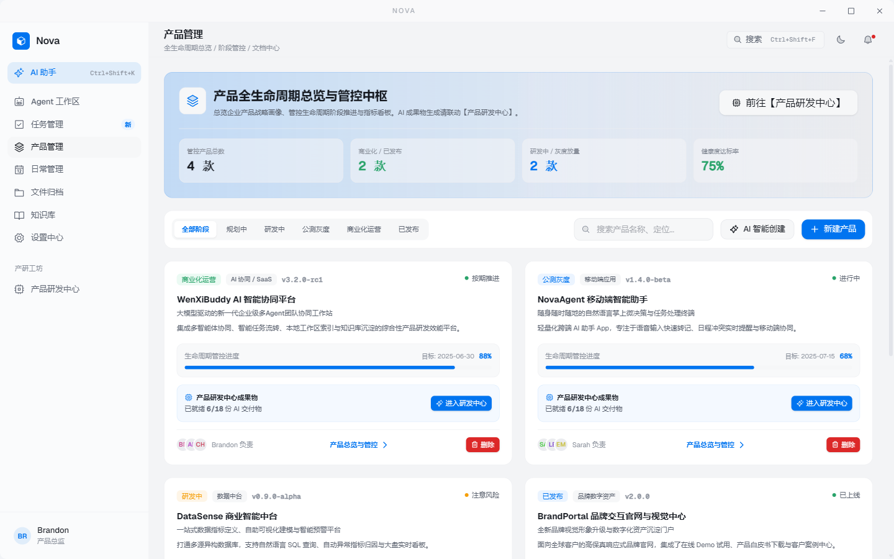
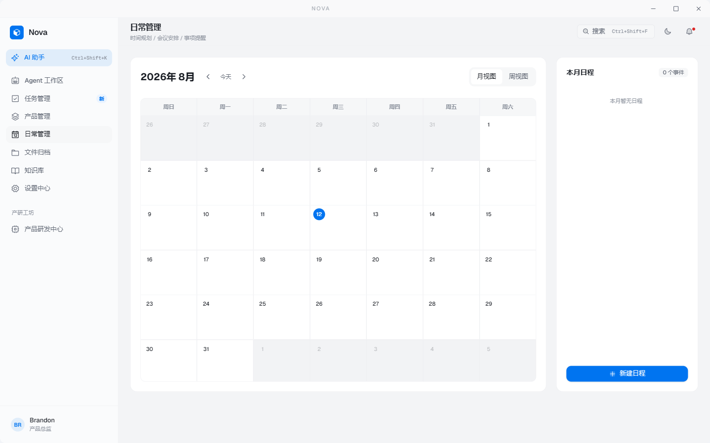
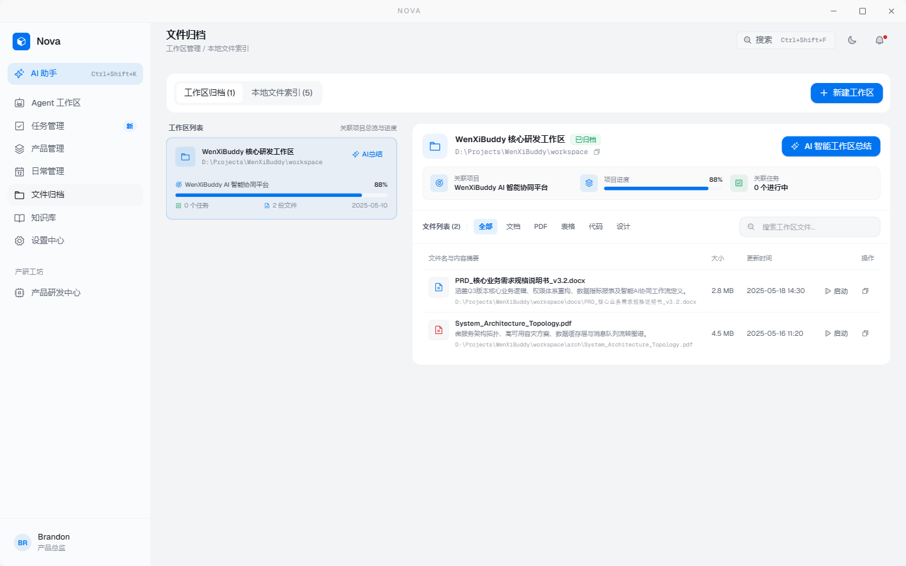
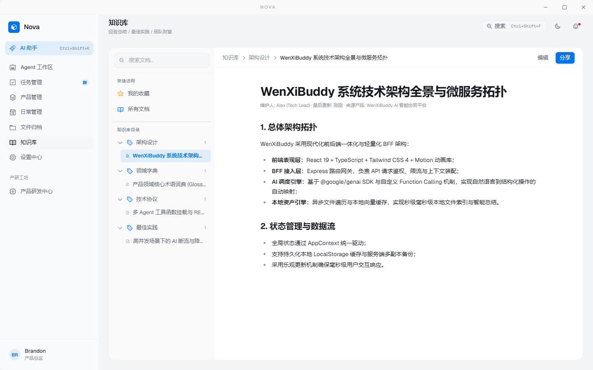
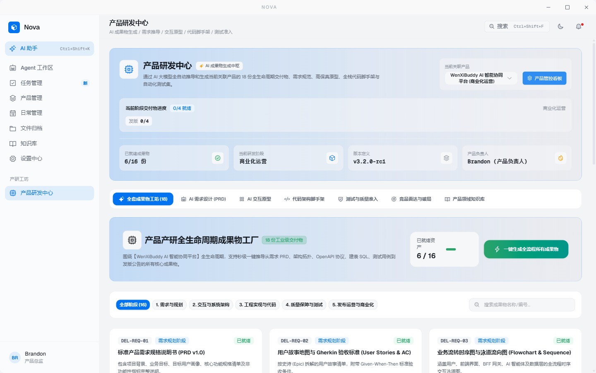
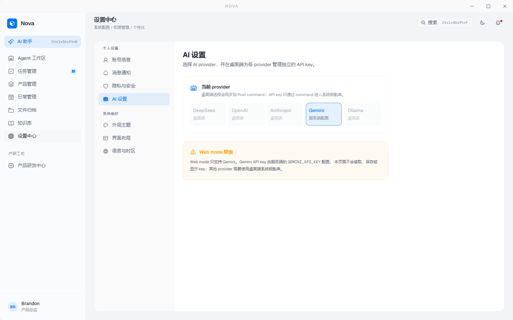
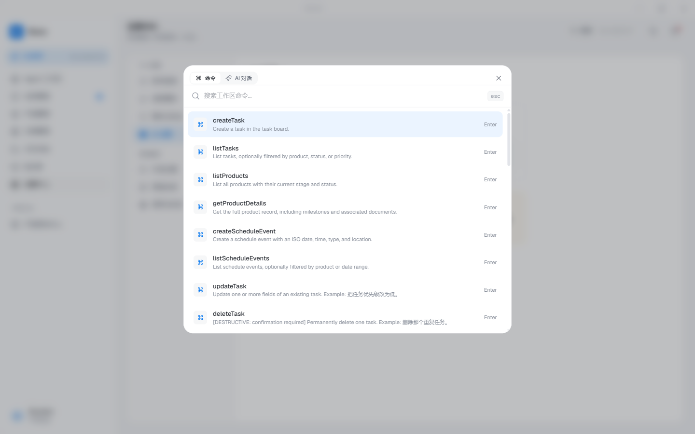

<div align="center">

# Nova

**AI native 产品经理桌面工作台**

让产品经理拥有一个**懂你、能替你干活**的桌面 AI Agent —— 不是 chatbot,而是能跑 Pipeline(需求→PRD→原型→代码→测试)、有第二大脑、关键节点 HITL 的真 Agent。

[功能](#-核心功能) · [截图](#-截图) · [快速开始](#-快速开始) · [技术栈](#-技术栈) · [架构](#-架构) · [开发指南](#-开发指南) · [文档](#-文档)

</div>

---

## ✨ 核心功能

- **可视化 PM 工作台** —— 任务看板、产品全生命周期、月历日程、文件归档、知识库、研发中心,Apple 风格设计系统,深浅色主题。
- **AI Agent 工作流** —— ⌘K 命令面板(Raycast 风格)+ 侧滑 ChatPanel,33+ tools 覆盖任务/日程/产品/知识/文件,自然语言直接执行操作。
- **多 Provider LLM** —— DeepSeek / OpenAI / Anthropic / Gemini / Ollama 任选,rust `rig` 库统一接口,API key 走 OS keychain(Windows Credential Manager / macOS Keychain)。
- **跨模块弱关联** —— 任务 → 日程一键安排、产品 → 任务/日程双向徽章、删除产品级联清理、产品阶段 → 研发交付物就绪率联动。
- **MDX WYSIWYG 编辑** —— 知识库和产品文档实时渲染 Markdown,代码块语法高亮,表格/任务列表 GFM 支持。
- **本地优先持久化** —— Zustand `persist` → SQLite (`tauri-plugin-sql`),零云端依赖,数据完全自主。

## 📸 截图

### Agent 工作区(默认主页)


### 任务管理 · Kanban 看板(拖拽 + 内联编辑 + AI 卡片菜单)


### 产品管理(全生命周期总览 + 阶段管控)


### 日常管理(真实月历 + 月份切换 + 任务徽章)


### 文件归档(工作区管理 + 文件索引)


### 知识库(MDX WYSIWYG 编辑,产品/全局分桶)


### 产品研发中心(18 个交付物 · 需求→原型→代码→测试全流程)


### 设置中心 · AI Provider 选择器(per-provider keychain)


### ⌘K 命令面板(Ctrl+Shift+P,33+ tools 即时触发)


### AI 助手 ChatPanel(Ctrl+Shift+K,多轮对话 + tool trace)


## 🚀 快速开始

### 前置依赖

- **Node.js** 22+
- **Rust toolchain**(可选,仅桌面端构建需要)
- **Tauri v2 prerequisites**(可选,仅桌面端构建需要)

### Web Dev 模式(快速预览)

```bash
npm install
GEMINI_API_KEY=<your-key> npm run dev
# 打开 http://localhost:3000
```

Web 模式下 AI 仅支持 Gemini(API key 由服务端 `.env` 注入,不进客户端 bundle),其他 provider 需要桌面端。

### Tauri 桌面端(完整功能)

```bash
npm install
npm run tauri:dev      # 开发模式,热重载
npm run tauri:build    # 生产构建(Win/macOS/Linux 原生安装包)
```

桌面端启动后,进 **设置中心 → AI 设置** 选择 provider 并保存 API key(key 写入 OS keychain,重启不丢)。

## 🛠 技术栈

| 层 | 技术 | 备注 |
|----|------|------|
| **前端** | React 19 + Vite 6 + TypeScript 5 | 桌面优化,1440×900 基准 |
| **样式** | Tailwind v4(`@theme` directive)+ 设计 tokens(`src/styles/tokens.css`) | 严禁硬编码颜色 |
| **组件** | Radix UI primitives + motion(Framer) | 20+ 自研 UI 组件 |
| **状态** | Zustand 5(`persist` middleware) | 6 个 store + AppContext 兼容层 |
| **持久化** | `tauri-plugin-sql`(SQLite `kv_store` 表) | Web 模式 localStorage 兜底 |
| **图标** | @phosphor-icons/react(`weight="duotone"`) | |
| **桌面** | Tauri v2 | 无边框 + 自定义 TitleBar + 透明 |
| **后端** | Rust:`rig` 0.41 + `keyring` 3 + `tokio_util::CancellationToken` | 多 provider LLM,流式 + 取消 |
| **Dev server** | Express(同进程,Vite middleware + `/api/chat` proxy) | Web 模式 fallback |
| **MDX 编辑** | MDXEditor 4.2 + react-markdown + remark-gfm + rehype-highlight | lazy 加载,~297 KB gzip |

## 🏗 架构

```
┌─────────────────────────────────────────────────────────────┐
│                    React Webview (TS)                       │
│  Views ── Components ── UI primitives                       │
│      │                                                      │
│      ├── Zustand stores ── persist ── SQLite (Tauri SQL)    │
│      │                                                      │
│      └── AI toolLoop (33+ Zod-defined tools)                │
│             │                                               │
│              ← Tauri IPC (invoke + Channel<StreamChunk>) →  │
├─────────────────────────────────────────────────────────────┤
│                    Rust Backend                             │
│  commands.rs ── chat_with_tools ── rig ── DeepSeek/OAI/...  │
│                │                                            │
│                └── keychain (Windows/macOS/Linux native)    │
└─────────────────────────────────────────────────────────────┘
```

**核心原则:**

1. **Rust 转发,JS 执行** —— LLM 调用走 Rust(`rig`),tool 执行留在 webview(JS 调 Zustand store)。Rust 是 LLM 边界,JS 是业务边界。
2. **API key 不进客户端 bundle** —— 通过 `keyring` 写 OS keychain,Tauri 命令是唯一读取入口,前端只看 `has_provider_key: boolean`。
3. **流式 + 可取消** —— `Channel<StreamChunk>` token-by-token 流式输出,`CancellationToken` 允许前端 Stop 按钮中途取消。
4. **本地优先** —— 数据全部存 SQLite,不依赖任何云服务;LLM 调用是唯一外部网络出口。

## 📁 项目结构

```
nova-pm-workspace/
├── src/                          # React 前端
│   ├── views/                    # 11 个 lazy-loaded 路由视图
│   ├── components/
│   │   ├── ui/                   # 20 个 Radix-based 原语(Button/Card/Dialog/...)
│   │   ├── layout/               # TitleBar / Sidebar / Header
│   │   ├── product/              # 产品管理/R&D 16 个子组件
│   │   ├── CmdKPalette.tsx       # ⌘K 命令面板
│   │   └── ChatPanel.tsx         # AI 助手侧滑
│   ├── stores/                   # 6 个 Zustand store + AppContext 兼容层
│   ├── ai/
│   │   ├── toolLoop.ts           # 多轮 tool_call 循环(5 iter 上限)
│   │   ├── registry.ts           # Zod schema → JSON Schema + 执行分发
│   │   ├── context.ts            # 核心 system prompt 注入
│   │   └── tools/                # 33+ tools(任务/日程/产品/研发/知识)
│   ├── hooks/                    # useTheme / useCmdK
│   ├── lib/                      # api.ts(Tauri IPC 适配)/ utils.ts
│   └── styles/                   # tokens.css(设计系统基础)
├── src-tauri/                    # Rust 桌面端
│   ├── src/
│   │   ├── lib.rs                # Tauri builder + 命令注册
│   │   ├── commands.rs           # chat / generate_project / keychain IPC
│   │   ├── llm.rs                # provider-agnostic Rig 集成
│   │   ├── keychain.rs           # OS keychain wrapper
│   │   └── error.rs              # AppError(thiserror)
│   ├── Cargo.toml
│   └── tauri.conf.json           # 窗口配置 + CSP + capabilities
├── server.ts                     # Express dev server(Vite middleware + /api/chat)
├── docs/                         # 设计文档(架构 / 技术栈 / Pipeline / 决策)
└── .planning/                    # GSD 工作流产物(ROADMAP / phase plans / UAT)
```

## 💻 开发指南

### 常用命令

```bash
# 开发
npm run dev               # Web dev 模式(Express + Vite,端口 3000)
npm run tauri:dev         # 桌面端开发模式(完整功能)

# 构建
npm run build             # 前端生产构建
npm run tauri:build       # 桌面端生产构建(.exe/.msi/.app/.dmg/AppImage)

# 检查
npm run lint              # TypeScript 类型检查(tsc --noEmit)
npm run test              # 运行 src/stores/__tests__/*.test.ts

# 后端
cd src-tauri && cargo check      # Rust 编译检查
cd src-tauri && cargo test       # Rust 单元测试
```

### 全局快捷键

所有快捷键统一为 `Ctrl+Shift+<key>`(macOS 为 `⌘+Shift+<key>`),避免与系统/浏览器原生冲突:

| 快捷键 | 作用 |
|--------|------|
| `Ctrl+Shift+K` | 打开/关闭 AI 助手 ChatPanel |
| `Ctrl+Shift+P` | 打开 ⌘K 命令面板 |
| `Ctrl+Shift+F` | 打开搜索 |
| `Esc` | 关闭当前模态 |

### Tauri IPC 适配

前端通过 `src/lib/api.ts` 单一 chokepoint 调用 Rust,自动分支:

- **Tauri 桌面端**:`invoke()` + `Channel<StreamChunk>` 流式
- **Web dev**:`fetch('/api/chat')` + NDJSON 流式(Express proxy)

调用方代码完全一致,平台差异封装在适配层内。

## 📚 文档

- [设计文档索引](docs/README.md) —— 架构 / 技术栈 / Pipeline / 决策记录
- [架构设计](docs/ARCHITECTURE.md) —— 系统整体架构、数据流、安全设计
- [技术选型](docs/TECH_STACK.md) —— 技术栈选择、依赖清单、扩展考虑
- [Pipeline 设计](docs/PIPELINE_DESIGN.md) —— 工作流设计、状态定义、HITL 交互
- [GSD 工作流](.planning/ROADMAP.md) —— Roadmap、Phase plans、UAT 报告

## 🗺 路线图

**v0.2.0(已交付)** —— 日常管理 CRUD + 弱关联 + AI 驱动:

- ✅ Task CRUD 补全 + 拖拽看板
- ✅ Schedule CRUD + 真实月历
- ✅ 跨模块联动 + 产品-研发联动
- ✅ MDXEditor 集成
- ✅ AI 助手基础架构 + 任务/日程/文件/知识库闭环(33+ tools)

**v0.3+(规划中)** —— 真 Agent 能力:

- ⏳ GraphFlow + Rig PoC(工作流引擎)
- ⏳ LanceDB 向量检索(知识库语义搜索)
- ⏳ 工作区真磁盘扫描
- ⏳ R&D 交付物 AI 升级(setTimeout mock → 真 LLM)
- ⏳ CSP 显式声明 + 安全加固

详细计划见 [.planning/ROADMAP.md](.planning/ROADMAP.md)。

## ⚠️ 已知限制

- **Web dev 模式 AI 仅支持 Gemini**(其他 provider 需桌面端 OS keychain)。
- **文件归档数据为 mock**:`workspaceStore.files` 是硬编码字符串,不扫描真磁盘。v0.3+ 计划接入 Tauri fs。
- **R&D 交付物 `*AI` 方法为 setTimeout + 模板字符串**,不是真 LLM 调用。Phase 11 success criteria 6 待迁移。
- **CSP 当前为 `null`**(开发期 debt),生产构建前需收紧。

## 📄 License

MIT

---

<div align="center">

Built with [Tauri](https://tauri.app/) · [React](https://react.dev/) · [Rig](https://github.com/0xPlaygrounds/rig)

</div>
